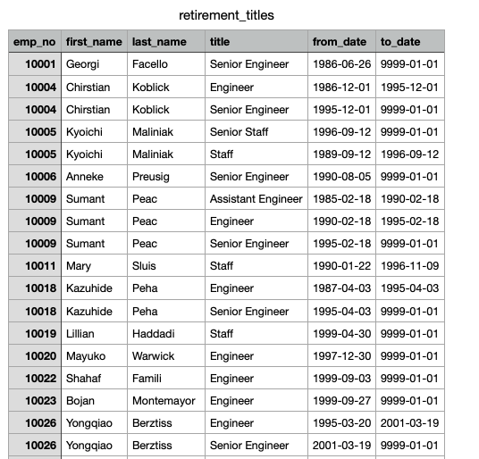
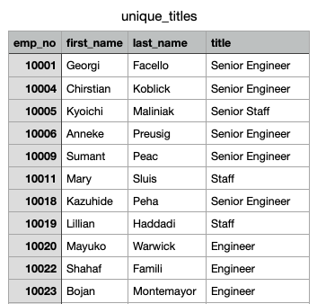
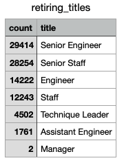

# Pewlett-Hackard-Analysis

## Overview of Analysis
In this analysis we are helping the manager at Pewlett-Hackard prepare for the "silver tsunami", onset by the increase in retirement of baby boomers. We used the PostgreSQL database to conduct this analysis. In the analysis we gathered information on the number of retiring employees by title, and the retiring employees who are eligible for the mentorship program. This analysis helps the managers plan for the future at Pewlett-Hackard, and the measures that need to be taken to deal with the large employee shift. 

## Results 
1) In the first part of the analysis we retrieved columns from the employees and titles table, and joined the two tables using INNER JOIN caluse. The birth date column was filtered to only show the retiring employees, who were born between 1952 and 1955. The resulting table (shown below) includes the employee number, first and last name, title, from date and to date of each retiring employee. 

2) In the above table, some employees showed up more than once because they occupied various roles during their time at Pewlett Hackard. To remove the duplicate entries, the DISTINCT ON statement was used to retrieve only the first occurence of each employee number. The resulting table (shown below), includes the most recent title of each retiring employee. 

3) Next, the COUNT() function was used to retrieve the number of each title from the previous table. The resulting table (shown below), shows the number of employees retiring under each title. 

