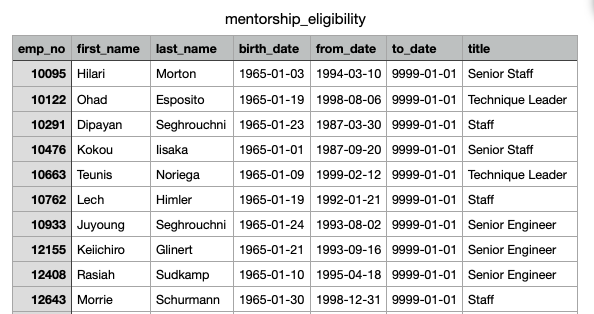

# Pewlett-Hackard-Analysis

## Overview of Analysis
In this analysis we are helping the manager at Pewlett-Hackard prepare for the "silver tsunami", onset by the increase in retirement of baby boomers. We used the PostgreSQL database to conduct this analysis. In the analysis we gathered information on the number of retiring employees by title, and the employees who are eligible for the mentorship program. This analysis helps the managers plan for the future at Pewlett-Hackard, and the measures that need to be taken to deal with the large employee shift. 

## Results 
1) In the first part of the analysis we retrieved columns from the employees and titles tables, and joined the two tables using INNER JOIN clause. The birth date column was filtered to only show the retiring employees, who were born between 1952 and 1955. The resulting table (shown below) includes the employee number, first and last name, title, from-date and to-date of each retiring employee. 

2) In the above table, some employees showed up more than once because they occupied various roles during their time at Pewlett Hackard. To remove the duplicate entries, the DISTINCT ON statement was used to retrieve only the first occurence of each employee number. The resulting table (shown below), includes the most recent title of each retiring employee. 

3) Next, the COUNT() function and GROUP BY statement were used to retrieve the number of each title from the previous table. The resulting table (shown below), shows the number of employees retiring under each title. It is apparent from the table below that a large number of senior engineers and senior staff are retiring.

4) The final part of the analysis was centered around the mentorship program. First, we retrieved columns from the employees, department employee and titles tables, and joined the three tables using INNER JOIN clause. The DISTINT ON statement was used to retrieve the first occurence of each employee number, similar to point #2. This time, the birth dates were filtered to only include employees born in 1965 and the to-dates were filtered to gather current workers, as these are the employees eligible for the mentorship program. 

## Summary 
1) According to the table in results point #3, 29,414 senior engineers, 28,254 senior staff, 14,222 engineers, 12,243 staff, 4,502 technique leaders, 1,761 assistant engineers and 2 managers will be retiring. That means, a total of 90,398 roles will need to be filled as a result of the "silver tsunami" 

2) According to the table in results point #4, there seems to be some variation in the titles of eligible mentors, with a good portion occupying lead or senior level positions. As a result, there seems to be enough qualified employees to mentor the next generation of Pewlett Hackard employees. 

3) To dive deeper into the Pelwett Hackard analysis and gain insight on the "silver tsunami", we can look into the specific departments that each retiring employee works in. The titles do not provide much insight into the specifc tasks they do, rather the position they hold within the department. Gathering department info will be useful when hiring skilled employees, to ensure that each department is receiving adequate support after the "silver tsunami". An additional query can be written to get the count of employees retiring from each department. We can also do a more specific analysis with the eligible mentors, and use the count() function to gather the number of eligible mentors under each title. This analysis can be used to further answer summary question #2. It shows that half of the eligible mentors occupy lead or senior level positions, and the other half occupy assistant or staff level positions. The additional queries are attached below. 

[Additional Queries](Images/additional_queries.sql)

